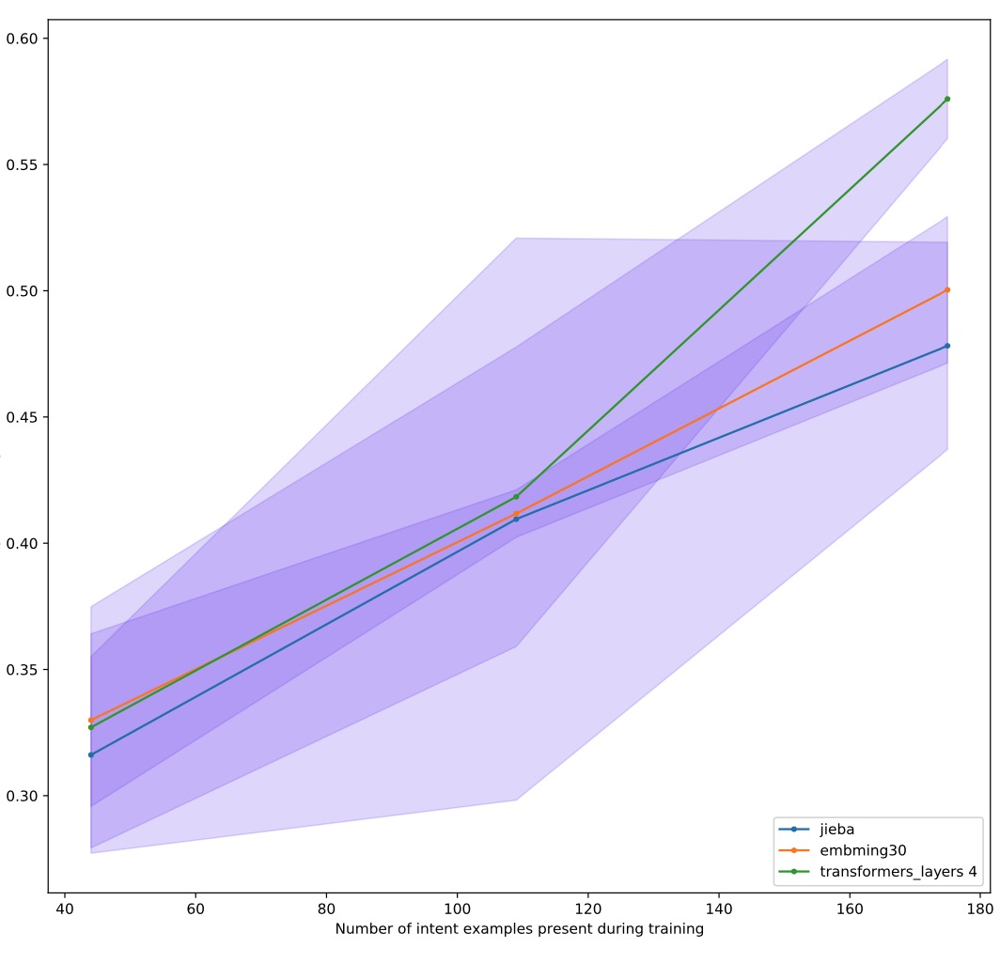

# Rasa NLU Components using PaddleNLP

[](https://pypi.python.org/pypi/rasa_paddlenlp)


## Features

- 兼容paddlenlp2.3 以及 Ernie3.0
- by bigbrother666

## Usage
#### 0、安装rasa3.x

```shell
pip install rasa
```

#### 1、安装paddlenlp 2.3.4

```shell
pip install paddlenlp==2.3.3
```
注：这一步之前需要安装PaddlePaddle，请自行查阅paddle官网，

如果需要使用gpu，请注意安装paddle的gpu版本

#### 2、建立文件夹，结构如下

```
.\
|
|--configs
|--data
```

#### 3、把本repo deploy分支下的rasa-paddlenlp文件夹整个拷贝到 .\下

#### 4、配置config.yml，可以多配置几个，以便比较哪个效果最好，所有配置文件都扔到configs里面

repo中config文件夹里面有最新示例

#### 5、准备nlu训练数据文件，按格式要求，可以准备多份，扔到 data里面，训练时程序会自动合并，

配置文件和训练文件不懂，[看这里](https://rasa.com/docs/rasa/nlu-training-data)

#### 6、在.\中运行full-test，遴选出最优的config

```shell
rasa test nlu --config configs --percentages 20 50 80
```

注意：这一步config1和config5只能保留一个，把另一个暂时移出configs文件夹

这一步需要漫长的等待…………

#### 7、在.\results文件夹下查阅nlu_model_comparison_graph.pdf文件

注意两个信息：

1、分值最高的曲线对应的configs就是你对应这批数据该用的；

2、如果你发现曲线到最后还处于上升姿态，说明你还可以通过追加nlu训练数据提高模型表现。

除了以上信息外也可以进入具体文件下查看细节

#### 8、把表现最好的config文件拷贝到.\中，并命名为 config.yml 然后在.\目录执行

```shell
rasa train nlu
```

#### 9、自己试用

```shell
rasa shell nlu
```

#### 10、api访问

```shell
rasa run --enable-api
```

注意：这一步可以通过 -i 参数指定侦听地址，，默认是 http://0.0.0.0(linux下) 或者 http://localhost(windows下)

通过 -p 指定侦听端口

另外 rasa shell 命令也支持 --enable-api参数

#### 11、如果数据有更新，更新量不大的话，建议先test下现有config

```shell
rasa test nlu --nlu 新数据文件 --cross-validation
```

--nlu后面跟新数据文件的位置，当然也可以就放在data下面，这样就不必指定了，但是要千万注意：**rasa会自动把data下面的所有yml文件合并** 所以如果你只想测试特定数据，记得把其他的yml文件暂时移出去！

训练好也是到results文件夹下，主要看 intent_histogram.png，如果左边蓝条都集中在上部，右侧红条都集中在下部（当然没有更好），说明现有config对新数据泛化的也不错，可以沿用。

更加详细的，可以看同名目录下的两个json文件，一个列出了所有识别错误的数据，一个列出个各个class的recall 精度 特异以及F1分值。

（其实这个也可以用来比较已有模型的表现，注意通过--model参数指定测试的模型，或者干脆去掉--cross-validataion参数，就会自动选择models下面最新的模型测试）

#### 12、上面用的是交叉验证，也可以用传统的训练方法，但你的数据要足够多

先拆分测试集和训练集

```shell
rasa data split nlu
```

之后用训练集训练，测试集测试……

个人感觉没啥必要，都是小模型，你也没那么多数据，用官方默认的方法挺好

另外最后注意，rasa shell和rasa run都会默认调起同级models文件夹下最新的模型，这两个命令不看config.yml的，模型会按照训练时的pipeline进行predict。

-------------

### 有关PaddleNLP2.3兼容和Ernie调起的问题（本项目主要代码更改）：

paddlenlp2.3跟2.2相比在tokenizer的方法上有比较大的变化，所以我们主要需要更改paddlenlp_tokenizer.py，主要是更改126行，增加两个入参即可，分别是：

```
return_dict=False
max_length=512
```

然后Ernie3.0的返回跟bert不太一样，所以为了调起ernie3.0还需要更改130行为：

**2.3.5 以后版本无需更改这里，改了不能调起，但是经过实测使用paddlenlp2.3.3以后版本，效果会明显下降！！！具体原因不知，强烈建议使用2.3.3**

```
if e['special_tokens_mask'][0] == 1:
```

## 2022.9.8update【关于config调优】

经过Simon Liang的指点，通过阅读[这篇文章](https://botfront.io/blog/better-intent-classification-and-entity-extraction-with-diet-classifier-pipeline-optimization)
我对rasa的config配置有了更加深刻认识，然后又通过反复的实验比对，现在终于能够在自己项目的数据集上把F1做到0.6了~（最开始都只有0.4x）

所以本次更新主要记录一些config配置心得，同时更新了我目前在用的config文件供大家参考，不过需要说明的是：config是与数据高度相关的，也就是说基本上不同的数据，表现最好的config都不一样。

比如在我这里，transformer_layers和embedding_dimension的值设太高效果反而不会好，主要就是因为我目前的项目数据集意图数量才12个，整个数据也才区区300多条。但是如果你有120个意图，几千条数据的话，那么这两项，尤其是ed就应该调高很多……不过从测试出来的F1曲线来看，目前config文件夹下
的两个config在30个意图分类以及1000条训练数据以内应该都是较优的，可以直接用，也欢迎大家不断分享性能更好的config！

首先原示例中的
```
- name: "CountVectorsFeaturizer"
 analyzer: "char_wb"
 min_ngram: 1
 max_ngram: 7
```

这一部分是需要去掉的，这一部分主要是用于英文文本，通过拆分出字母级的训练词表，从而使模型可以具有一定的抵抗拼写错误的能力，但因为Ernie是中文模型，所以完全用不上这一块，反而会干扰效果。

**但是如果你是用jieba+RegexFeaturizer的话，这一部分还是要保留的，有比没有效果好，哪怕训练语料都是中文！！！**

（不过话说，几个月试下来，无论怎么折腾，jieba+RegexFeaturizer的效果都不如Ernie，所以还是建议大家直接用Ernie。有兴趣的同学可以看result文件夹下我最初在5月份的时候对jieba、bert和Ernie的比较数据）

如果你坚持使用jieba+RegexFeaturizer的话，那么你可以加上这句，也许效果会有提升，但是Ernie方案中加了这个效果是下降的

```
use_masked_language_model: True
```

回到我们的Ernie方案，主要是在DietClassifier中进行调优，增加如下两项：

```
embedding_dimension: 30
transformers_layers: 4
```

默认这两个的值分别是20和2，经过反复试验，适当调高（相对于你的训练数据量）这两个值，会有明显改善。但也要针对具体情况。

具体而言如果你用的是GPU的话，那么embedding_dimension不要调，transformers_layers可以调到4；但是如果你用的是CPU的话，那么embedding_dimension调到30，transformers_layers调到8。
试验比对，再增加的话，效果是下降的。有趣的是，这两个参数不管怎么调在jieba+RegexFeaturizer方案中貌似都不起什么作用……

分析下来，我个人认为这两个参数的选择要综合训练数据量相对于设备算力的情况。以我现在的训练数量（data文件夹下），只有12个意图分类和300多条训练数据，这个数据量的情况下GPU上可能只需要把transformers_layers调到4就可以了，但是CPU上就需要把transformers_layers调到8并且把embedding_dimension调到30。

同时根据下面这个图



可以看出，绿色线（gpu下config）还是有随着训练数据量增加而提高的空间的，个人估计30个意图、1000条训练数据内这个config应该都还是够用的……

**所以各位如果数据量和意图类别不是很多的情况下，可以直接选择我这里提供的config，先用下面命令评估下**

```shell
rasa test nlu --nlu 新数据文件 --cross-validation
```

**如果test上的F1差不多0.6了，那么就可以用了，反之的话根据自己情况调整embedding_dimension和transformers_layers的值。**

另外，试验下来，对于Ernie来说，如下两个还是要保留的，虽然按照道理说，其实Ernie也用不上这两块。但试验数据就是不管去掉哪个，或者一起拿掉，都会导致明显的下降（有兴趣可以看result里面的对比）
```
- name: "LexicalSyntacticFeaturizer"
- name: "CountVectorsFeaturizer"
```

不过目前令我最不解的还是为什么这套方案搭配paddlenlp2.3.5（含）以上版本性能会大幅下降，按照道理说 `e['special_tokens_mask'][0] `这里应该是之前paddlenlp的漏洞啊，2.3.5补上了后居然效果还更加不好了……

rasa的特点还是模型小，开销小，以我目前的intent数量其实根本不需要gpu，i5的cpu就足够了，除了对比训练比较慢外……

另外说到训练，强烈建议大家在第一次训练时加上

```
tensorboard_log_directory: "./tensorboard"
tensorboard_log_level: "epoch"
```

这两项，之后你可以通过tensorboard看出来最佳的训练epoch。但是使用这两项的时候记得把如下两项打开，这样可以综合比较测试集上的loss和accuracy，其实这个更加重要，训练集上都是0.9以上，其实没啥可看的

```
evaluate_every_number_of_epochs: 20
evaluate_on_number_of_examples: 12
```

但是一旦你确定了最佳epoch的话，正式训练的时候就不要再加evaluate了，毕竟那会减少你的训练数据，除非你数据量很大。这个时候tensorboard开不开就随你了，开着可以最后看一眼是不是训练到位了。

有关，tensorboard更加详细的介绍，[看这里](https://rasa.com/blog/tensorboard-in-rasa/)

由于我只用rasa的nlu，所以我也只看scalars下面的i_acc和t_loss。

## Credits

This package took inspiration from the following projects:

- [Rasa](https://github.com/rasahq/rasa)
- [PaddleNLP](https://github.com/PaddlePaddle/PaddleNLP)

This package was created with Cookiecutter and the audreyr/cookiecutter-pypackage project template.

- [Cookiecutter](https://github.com/audreyr/cookiecutter)
- [`audreyr/cookiecutter-pypackage`](https://github.com/audreyr/cookiecutter-pypackage)

## License

[MIT](./LICENSE)
